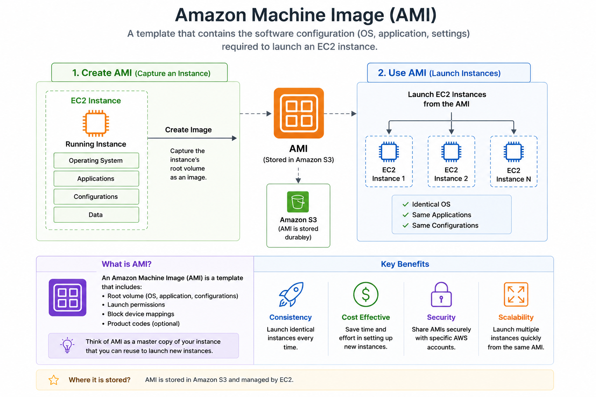

# AWS Project: Creating and Managing Amazon Machine Images (AMI) on AWS

One of the most useful features in AWS is the ability to quickly create reusable server templates.

In this project, I explored Amazon Machine Images (AMI) and learned how they help automate and simplify infrastructure deployment.

The goal of this project was to:
- Understand what an AMI is
- Create a custom AMI from an EC2 instance
- Launch new EC2 instances using the AMI
- Learn how AMIs improve scalability and consistency
- Understand backup and recovery concepts in AWS

By the end of this project, I gained hands-on experience creating reusable machine images similar to what is commonly used in real-world cloud and DevOps environments.

---

# Project Architecture

```text
Configured EC2 Instance
          ↓
Create AMI
          ↓
Reusable Machine Image
          ↓
Launch Multiple EC2 Instances
```

---

# Prerequisites

To follow along with this project, you only need:

- An AWS account
- Basic knowledge of EC2
- A running EC2 instance
- SSH key pair

---

# AWS Services Used

For this project, I made use of:

- Amazon EC2
- Amazon Machine Image (AMI)
- EBS Snapshots
- IAM

---

# Understanding Amazon Machine Image (AMI)

An Amazon Machine Image (AMI) is a pre-configured template used to launch EC2 instances.

It contains:
- Operating system
- Installed software
- Configurations
- Application code
- System settings

Think of an AMI as a “blueprint” or “golden image” of a server.

Instead of manually configuring every new server from scratch, AMIs allow engineers to quickly launch identical instances.

This improves:
- Consistency
- Scalability
- Deployment speed
- Disaster recovery

---

# Step 1: Launch an EC2 Instance

I started by launching an Ubuntu EC2 instance.

For this setup, I used:

- AMI: Ubuntu
- Instance type: t2.micro

I also configured:
- SSH access
- HTTP access

---

# Step 2: Connect to the EC2 Instance

After launching the instance, I connected using SSH:

```bash
ssh -i key.pem ubuntu@<public-ip>
```

Once connected, I updated the server:

```bash
sudo apt update
```

---

# Step 3: Install and Configure Software

To make the instance useful before creating the AMI, I installed Nginx.

Commands used:

```bash
sudo apt install nginx -y
```

Then I started and enabled the service:

```bash
sudo systemctl start nginx
sudo systemctl enable nginx
```

To confirm the setup, I visited the EC2 public IP address in the browser.

The Nginx default page loaded successfully.

---

# Step 4: Create a Custom AMI

Once the server was fully configured, I created a custom AMI from the EC2 instance.

From the AWS Console:

- Navigate to **EC2 Dashboard**
- Select the running instance
- Click:
```text
Actions → Image and templates → Create Image
```

I then:
- Added an image name
- Added a description
- Started the AMI creation process

AWS automatically created:
- An Amazon Machine Image
- EBS snapshots of attached volumes

---

# Step 5: Launch a New EC2 Instance Using the AMI

After the AMI became available, I launched a new EC2 instance using the custom image.

From the EC2 dashboard:

- Click **Launch Instance**
- Select **My AMIs**
- Choose the custom AMI

The newly launched instance already contained:
- Nginx installation
- Server configuration
- Existing application setup

This demonstrated how AMIs simplify server replication and deployment.

---

# Step 6: Verify Instance Consistency

I connected to the new EC2 instance and confirmed:

- Nginx was already installed
- Configuration remained intact
- Application setup matched the original instance

This showed how AMIs ensure consistent infrastructure deployment.

---

# AMI Components

An AMI typically contains:

## Operating System

Example:
- Ubuntu
- Amazon Linux
- Windows Server

---

## Application Software

Installed tools and applications such as:
- Nginx
- Apache
- Docker
- Node.js

---

## Configurations

Includes:
- System settings
- Installed packages
- Application configuration

---

## EBS Snapshots

AWS creates snapshots of attached EBS volumes during AMI creation.

These snapshots are used to recreate storage for new instances.

---

# Types of AMIs

## AWS Managed AMIs

Provided directly by AWS.

Example:
- Amazon Linux
- Ubuntu
- Windows

---

## Custom AMIs

Created by users from existing EC2 instances.

---

## Marketplace AMIs

Pre-configured images provided by third-party vendors.

Example:
- Jenkins
- Kubernetes
- Security tools

---

# Real-World Use Cases

## Auto Scaling

Launch identical EC2 instances automatically during high traffic.

---

## Disaster Recovery

Quickly restore servers using saved AMIs.

---

## Infrastructure Standardization

Ensure all servers use the same configuration.

---

## DevOps Automation

Use AMIs inside:
- CI/CD pipelines
- Infrastructure automation
- Immutable infrastructure setups

---

# Benefits of Using AMIs

## Faster Deployments

No need to manually configure every server.

---

## Consistency

All launched instances behave the same way.

---

## Backup and Recovery

AMIs act as server backups.

---

## Scalability

Quickly launch multiple identical servers.

---

# Challenges I Faced

Some issues I encountered during this project included:

- Waiting for AMI creation to complete
- Understanding EBS snapshot behavior
- Launching instances from the correct AMI
- Managing multiple AMI versions

Resolving these challenges helped me better understand AWS infrastructure automation concepts.

---

# Key Learnings

Through this project, I learned:

- What an Amazon Machine Image (AMI) is
- How AMIs simplify infrastructure deployment
- How AWS creates reusable server templates
- Relationship between AMIs and EBS snapshots
- Importance of automation and consistency in cloud environments

---

# Security Best Practices

## Remove Sensitive Data Before Creating AMIs

Avoid storing:
- Passwords
- API keys
- Sensitive credentials

inside machine images.

---

## Use IAM Permissions

Restrict who can create or launch AMIs.

---

## Regularly Update AMIs

Keep AMIs updated with:
- Security patches
- Latest software versions

---

# Conclusion

This project gave me practical hands-on experience creating and managing Amazon Machine Images (AMI) on AWS.

AMIs are a foundational part of cloud infrastructure because they help automate deployments, improve consistency, and simplify scaling.

By creating reusable server templates, I gained a deeper understanding of:
- Infrastructure automation
- Cloud scalability
- Disaster recovery
- DevOps deployment practices

