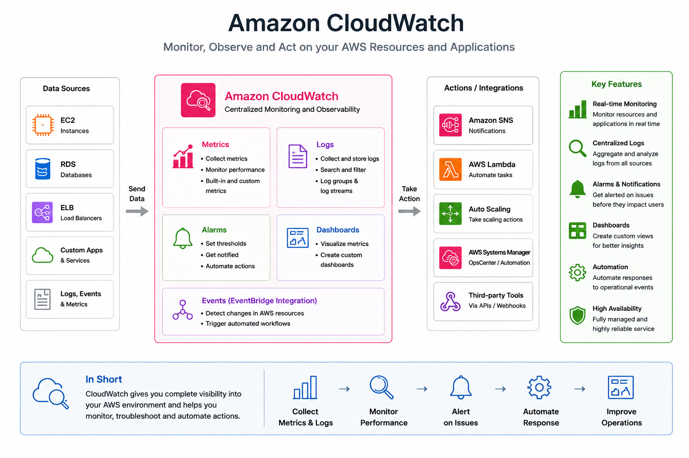

# AWS Project: Monitoring EC2 Instances and Application Logs using Amazon CloudWatch

Monitoring is one of the most important parts of cloud infrastructure.

In real-world production environments, simply deploying applications is not enough. Engineers also need visibility into:
- Server performance
- CPU usage
- Memory utilization
- Network traffic
- Application logs
- System health

In this project, I explored Amazon CloudWatch and learned how AWS monitoring and logging works.

The goal of this project was to:
- Monitor EC2 instances in real time
- Create CloudWatch alarms
- Track metrics and logs
- Understand observability in AWS
- Improve infrastructure monitoring and troubleshooting

By the end of this project, I gained hands-on experience setting up monitoring dashboards and alerts similar to what is used in real production cloud environments.

---

# Project Architecture

```text
EC2 Instance
      ↓
CloudWatch Agent
      ↓
Amazon CloudWatch
      ↓
Metrics • Logs • Alarms • Dashboards
```

---

# Prerequisites

To follow along with this project, you only need:

- An AWS account
- A running EC2 instance
- Basic Linux knowledge
- IAM permissions for CloudWatch

---

# AWS Services Used

For this project, I made use of:

- Amazon EC2
- Amazon CloudWatch
- IAM
- CloudWatch Agent
- SNS *(Optional for notifications)*

---

# Understanding Amazon CloudWatch

Amazon CloudWatch is AWS’s monitoring and observability service.

It helps monitor:
- Infrastructure
- Applications
- Logs
- Metrics
- Events

CloudWatch collects real-time data from AWS resources and allows engineers to:
- Visualize metrics
- Create alarms
- Troubleshoot issues
- Automate responses

---

# Step 1: Launch an EC2 Instance

I started by launching an Ubuntu EC2 instance.

For this setup, I used:

- AMI: Ubuntu
- Instance type: t2.micro

I also configured:
- SSH access
- HTTP access

---

# Step 2: Connect to the EC2 Instance

After launching the instance, I connected using SSH:

```bash
ssh -i key.pem ubuntu@<public-ip>
```

Once connected, I updated the system:

```bash
sudo apt update
```

---

# Step 3: Install CloudWatch Agent

To collect system-level metrics and logs, I installed the CloudWatch Agent.

Commands used:

```bash
sudo apt install amazon-cloudwatch-agent -y
```

This agent allows CloudWatch to collect:
- CPU usage
- Memory usage
- Disk usage
- Custom logs

---

# Step 4: Configure IAM Role for CloudWatch

Next, I created an IAM role with CloudWatch permissions.

I attached the following policy:

```text
CloudWatchAgentServerPolicy
```

Then attached the IAM role to the EC2 instance.

This allowed the instance to securely send metrics and logs to CloudWatch.

---

# Step 5: Configure the CloudWatch Agent

I configured the agent using the CloudWatch Agent Wizard:

```bash
sudo /opt/aws/amazon-cloudwatch-agent/bin/amazon-cloudwatch-agent-config-wizard
```

During setup, I selected:
- CPU metrics
- Memory metrics
- Disk metrics
- Log file collection

---

# Step 6: Start the CloudWatch Agent

After configuration, I started the agent:

```bash
sudo systemctl start amazon-cloudwatch-agent
```

I also enabled it to start automatically during boot:

```bash
sudo systemctl enable amazon-cloudwatch-agent
```

---

# Step 7: View Metrics in CloudWatch

From the AWS Console:

- Navigate to **CloudWatch**
- Open the **Metrics** section

Here, I was able to monitor:
- CPU Utilization
- Network Traffic
- Disk Usage
- Memory Usage

in real time.

---

# Step 8: Create a CloudWatch Alarm

Next, I created a CloudWatch Alarm to monitor CPU usage.

The goal was:
- Trigger an alert if CPU utilization exceeds 70%

Steps:
- Select EC2 CPU metric
- Define threshold
- Configure notification action

---

# Step 9: Configure SNS Notifications

To receive notifications, I integrated CloudWatch with Amazon SNS.

This allowed alerts to be sent via:
- Email
- SMS
- Notifications

Example use case:
```text
High CPU Usage → CloudWatch Alarm → SNS Notification
```

---

# Step 10: Create a CloudWatch Dashboard

I created a custom CloudWatch Dashboard to visualize system metrics.

The dashboard included:
- CPU Utilization
- Network In/Out
- Disk Usage
- Memory Usage

This helped centralize monitoring for the infrastructure.

---

# Step 11: Monitor Application Logs

CloudWatch can also collect logs from applications.

I configured log monitoring for:
- Nginx access logs
- System logs

Example log path:

```bash
/var/log/nginx/access.log
```

This allows easier troubleshooting and centralized logging.

---

# Real-World Use Cases

## Infrastructure Monitoring

Monitor:
- EC2 health
- Resource utilization
- System performance

---

## Alerting and Notifications

Automatically notify teams during:
- High CPU usage
- Low disk space
- Service failures

---

## Centralized Logging

Store logs securely in one location for:
- Debugging
- Auditing
- Analysis

---

## Auto Scaling Integration

CloudWatch metrics can trigger:
- Auto Scaling Groups
- Automated actions

---

# Challenges I Faced

Some issues I encountered during this project included:

- IAM permission errors
- CloudWatch Agent configuration troubleshooting
- Logs not appearing initially
- Alarm threshold tuning

Resolving these issues helped me better understand AWS monitoring and observability concepts.

---

# Key Learnings

Through this project, I learned:

- How CloudWatch collects metrics and logs
- How to configure monitoring agents
- How to create alarms and dashboards
- Importance of observability in cloud environments
- How monitoring improves reliability and troubleshooting

---

# Security Best Practices

## Use IAM Roles Instead of Access Keys

Avoid storing credentials directly on EC2 instances.

---

## Restrict Log Access

Only authorized users should access application logs.

---

## Monitor Critical Resources

Always create alarms for:
- CPU usage
- Memory usage
- Disk space
- Application failures

---

# Conclusion

This project gave me practical hands-on experience implementing monitoring and observability using Amazon CloudWatch.

Monitoring is a critical part of cloud engineering because it helps detect issues early, improve system reliability, and maintain application performance.

By setting up:
- Metrics
- Logs
- Alarms
- Dashboards

