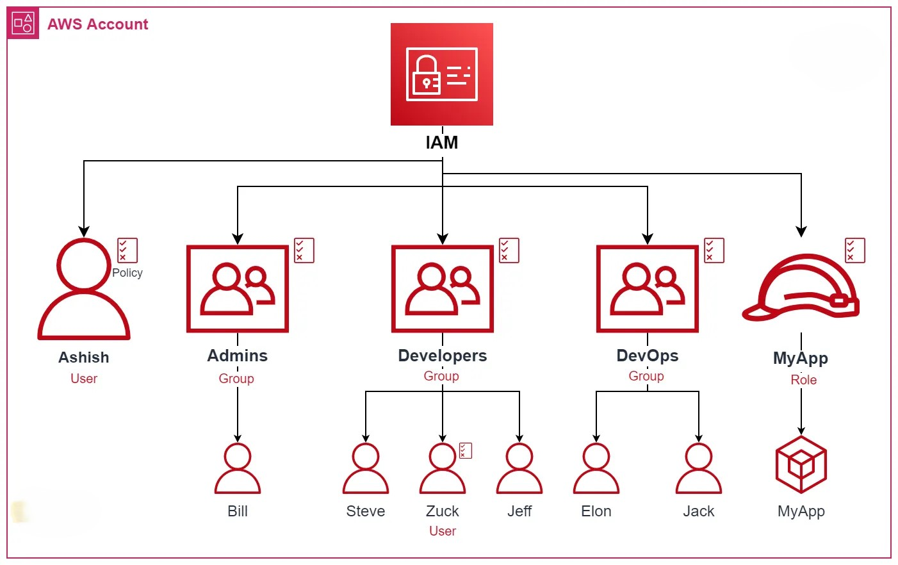

# IAM (Identity and Access Management)

Imagine you own a company office where different employees need different levels of access. Some employees may only need access to specific rooms, while administrators may need access to everything. This is where IAM comes into play in AWS.

AWS Identity and Access Management (IAM) is a service that helps you securely control access to AWS resources.

With IAM, you can:
- Create users and groups
- Assign permissions
- Control who can access AWS resources
- Improve account security

Think of IAM as the security and access control system for your AWS account.

It allows you to define:
- Who can log in
- What resources they can access
- What actions they can perform

For example:
- A developer may have access to EC2 and S3
- A database administrator may only access RDS
- A security team may only view logs and monitoring dashboards

IAM helps enforce the principle of **least privilege**, meaning users only get the permissions they absolutely need.


By default, the AWS root account has complete access to all AWS services and resources. However, AWS strongly recommends avoiding the use of the root account for daily tasks and instead creating IAM users with limited permissions.

---

# IAM Components

The following features help you securely manage access in AWS:

## IAM Users

An IAM user represents a person or application that interacts with AWS.

Each user can have:
- Username
- Password
- Access keys
- Permissions

Example:
```bash
DeveloperUser
```

---

## IAM Groups

Groups allow you to organize users with similar responsibilities.

Instead of assigning permissions individually, you can assign permissions to a group.

Example:
- Developers Group
- Admin Group
- ReadOnly Group

---

## IAM Policies

Policies are JSON documents that define permissions.

They specify:
- What actions are allowed or denied
- Which AWS resources can be accessed

Example actions:
```json
{
  "Effect": "Allow",
  "Action": "s3:ListBucket",
  "Resource": "*"
}
```

---

## IAM Roles

Roles provide temporary permissions to AWS services or users.

Unlike users, roles do not have passwords or access keys.

Common use cases:
- EC2 accessing S3
- Lambda accessing DynamoDB
- Cross-account access

---

## Multi-Factor Authentication (MFA)

MFA adds an extra layer of security by requiring:
- Password
- Verification code from a mobile device

This helps protect AWS accounts from unauthorized access.

---

## Access Keys

Access keys are used for programmatic access to AWS services.

They consist of:
- Access Key ID
- Secret Access Key

Used in:
- AWS CLI
- SDKs
- Automation scripts

---

## IAM Permission Boundaries

Permission boundaries set the maximum permissions an IAM entity can have.

They help control privilege escalation.

---

## Identity Federation

Identity federation allows users to log in using external identity providers such as:
- Google
- Microsoft Active Directory
- Okta

This enables Single Sign-On (SSO) access to AWS.

---

# IAM Workflow

```text
User/Application
       ↓
IAM Authentication
       ↓
IAM Authorization
       ↓
AWS Resource Access
```

---

# Common Use Cases

## Secure AWS Access

Create separate IAM users for team members instead of sharing the root account.

---

## Restrict Permissions

Use least privilege access to improve security.

Example:
- Developers can deploy EC2 instances
- Finance team can only view billing

---

## Service-to-Service Access

Use IAM roles to allow AWS services to communicate securely.

Example:
```text
EC2 → Access S3 Bucket
```

---

## CLI and Automation Access

Use access keys for automation scripts and CI/CD pipelines.

---

# IAM Best Practices

## Enable MFA
Always enable MFA for:
- Root account
- IAM users with administrative access

---

## Avoid Using Root Account
Use the root account only for account-level tasks.

---

## Follow Least Privilege Principle
Grant only the minimum permissions required.

---

## Rotate Access Keys
Regularly rotate access keys to improve security.

---

## Use Roles Instead of Hardcoded Credentials
Avoid storing AWS credentials directly inside applications.

---

# Resources

## AWS IAM Documentation

https://docs.aws.amazon.com/iam/

---

## IAM Best Practices

https://docs.aws.amazon.com/IAM/latest/UserGuide/best-practices.html

---

# Key Learnings

- IAM controls authentication and authorization in AWS
- Users, groups, policies, and roles are core IAM components
- IAM improves AWS account security
- Roles provide secure temporary access
- MFA adds additional protection

---

# Architecture Example

```text
IAM User → IAM Policy → AWS Resource
```

---

# Conclusion

AWS IAM is one of the most important AWS services because it controls access and security across your cloud environment.

Proper IAM configuration helps protect AWS resources, enforce security best practices, and ensure secure communication between users and services.
