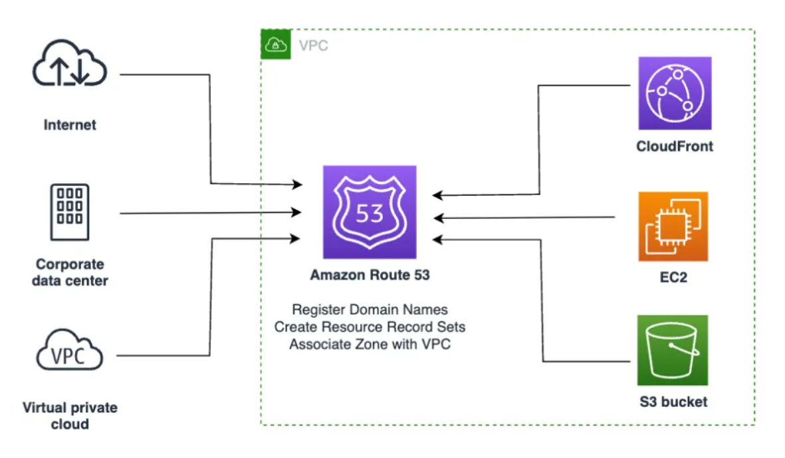

# Route 53

Imagine you have created a website or an application hosted on AWS, but people cannot access it easily because they would need to remember a long IP address like `54.231.120.45`. This is where Route 53 comes into play.

Amazon Route 53 is AWS’s scalable and highly available Domain Name System (DNS) web service. It helps users connect to your applications using easy-to-remember domain names like:

```bash
www.example.com
```

instead of IP addresses.

Think of Route 53 as the internet’s phonebook. When someone types your domain name into a browser, Route 53 translates that name into the IP address of your server or application.

Route 53 not only helps route users to websites but also improves application availability, reliability, and performance.

It can:
- Route traffic to AWS resources
- Register domain names
- Perform health checks
- Automatically redirect traffic if an application becomes unhealthy



By using Route 53, you can make your applications accessible globally with reliable DNS routing and traffic management features.

---

# Route 53 Components

The following features help you configure Route 53 for your applications:

## Hosted Zones

A hosted zone is a container for DNS records. Route 53 stores information about how you want to route traffic for your domain inside hosted zones.

There are two types:
- Public Hosted Zone
- Private Hosted Zone

---

## Domain Registration

Route 53 allows you to purchase and manage domain names directly from AWS.

Example:
```bash
mywebsite.com
```

---

## DNS Records

DNS records define how traffic should be routed for your domain.

Common record types include:
- A Record
- AAAA Record
- CNAME Record
- MX Record
- TXT Record

---

## Routing Policies

Routing policies determine how Route 53 responds to DNS queries.

### Simple Routing
Routes traffic to a single resource.

### Weighted Routing
Distributes traffic across multiple resources based on assigned weights.

### Latency-Based Routing
Routes users to the region with the lowest latency.

### Failover Routing
Redirects traffic to backup resources if the primary resource fails.

### Geolocation Routing
Routes traffic based on user geographic location.

---

## Health Checks

Health checks monitor the health and performance of your application endpoints.

If an endpoint becomes unhealthy, Route 53 can automatically redirect traffic to healthy resources.

---

## Alias Records

Alias records are used to point your domain directly to AWS resources like:
- Elastic Load Balancer (ELB)
- CloudFront Distribution
- S3 Static Website
- API Gateway

Unlike CNAME records, Alias records work at the root domain level.

---

## Private Hosted Zones

Private hosted zones allow DNS routing within a VPC.

They are used for internal applications and private communication between AWS resources.

---

# Route 53 Workflow

```text
User Request
     ↓
Domain Name
     ↓
Route 53 DNS Resolution
     ↓
Application Endpoint (EC2 / ALB / CloudFront / S3)
```

---

# Common Use Cases

## Hosting a Website
Connect your custom domain to:
- EC2 instance
- S3 static website
- Load balancer

---

## High Availability

Use health checks and failover routing to improve application uptime.

---

## Global Applications

Use latency-based routing to direct users to the nearest AWS region.

---

# Resources

## AWS Route 53 Documentation

https://docs.aws.amazon.com/route53/

---

## Route 53 Routing Policies

https://docs.aws.amazon.com/Route53/latest/DeveloperGuide/routing-policy.html

---

# Key Learnings

- Route 53 is AWS’s DNS service
- It maps domain names to IP addresses
- Supports multiple routing strategies
- Improves application availability and performance
- Integrates seamlessly with AWS services

---

# Architecture Example

```text
User → Route 53 → Load Balancer → EC2 Instances
```

---

# Conclusion

Amazon Route 53 is a powerful DNS and traffic routing service that helps applications remain highly available, scalable, and accessible worldwide.

It plays a critical role in cloud networking by connecting users to applications quickly and reliably.
