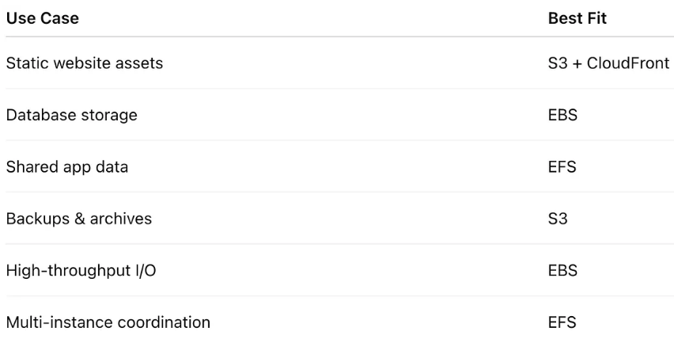

# Storage (EBS vs EFS vs S3)

Imagine you have different types of data and applications running in AWS. Some applications may require fast storage attached directly to a server, while others may need shared storage accessible by multiple servers or scalable storage for files, backups, and static websites.

This is where AWS storage services come into play.

AWS provides multiple storage solutions designed for different use cases. The three most commonly used storage services are:

- Amazon EBS (Elastic Block Store)
- Amazon EFS (Elastic File System)
- Amazon S3 (Simple Storage Service)

Each service is optimized for specific workloads and storage requirements.

Think of them like this:

- **EBS** → A hard drive attached to one server
- **EFS** → A shared network drive accessible by multiple servers
- **S3** → Unlimited cloud object storage for files and backups

Understanding when to use each storage service is an important skill in cloud engineering and architecture design.



---

# Amazon EBS (Elastic Block Store)

Amazon EBS provides block-level storage volumes that can be attached to EC2 instances.

EBS works like a virtual hard disk for your EC2 server.

It is mainly used for:
- Operating systems
- Databases
- Application storage
- High-performance workloads

---

## Key Features of EBS

- Attached to a single EC2 instance
- Persistent storage
- High performance and low latency
- Supports SSD and HDD volumes
- Snapshots for backups

---

## Common Use Cases

- Hosting operating systems
- Running databases like MySQL or PostgreSQL
- Transaction-heavy applications

---

## Example Workflow

```text
EC2 Instance → Attached EBS Volume
```

---

# Amazon EFS (Elastic File System)

Amazon EFS is a fully managed shared file storage service.

Unlike EBS, multiple EC2 instances can access the same EFS storage simultaneously.

It behaves like a shared network file system.

---

## Key Features of EFS

- Shared file storage
- Multiple EC2 instances can connect
- Automatically scales storage
- Fully managed by AWS
- Supports Linux-based workloads

---

## Common Use Cases

- Shared application storage
- Content management systems
- Web server farms
- Kubernetes persistent storage

---

## Example Workflow

```text
EC2 Instance 1
        ↓
      Amazon EFS
        ↑
EC2 Instance 2
```

---

# Amazon S3 (Simple Storage Service)

Amazon S3 is an object storage service designed for storing and retrieving unlimited amounts of data.

S3 stores data as objects inside buckets.

It is one of the most widely used AWS services because of its scalability, durability, and cost-effectiveness.

---

## Key Features of S3

- Unlimited storage capacity
- Highly durable and scalable
- Accessible over the internet
- Supports lifecycle management
- Multiple storage classes available

---

## Common Use Cases

- Static website hosting
- Backups and archives
- Media storage
- Log storage
- Data lakes

---

## Example Workflow

```text
User/Application → S3 Bucket
```

---

# EBS vs EFS vs S3 Comparison

| Feature | EBS | EFS | S3 |
|---|---|---|---|
| Storage Type | Block Storage | File Storage | Object Storage |
| Attach To | Single EC2 | Multiple EC2 | Internet/AWS Services |
| Scalability | Manual | Automatic | Unlimited |
| Performance | Very High | High | Depends on Access |
| Shared Access | No | Yes | Yes |
| Best For | Databases, OS | Shared Files | Backups, Static Files |
| Protocol | Block Level | NFS | HTTP/API |
| Availability Zone | Single AZ | Multi-AZ | Regional |
| Persistence | Yes | Yes | Yes |

---

# Choosing the Right Storage Service

## Use EBS When:
- You need fast block storage
- Running databases
- Hosting operating systems

---

## Use EFS When:
- Multiple EC2 instances need shared access
- Running containerized applications
- Shared application data is required

---

## Use S3 When:
- Storing files, backups, or media
- Hosting static websites
- Long-term storage is needed

---

# Storage Workflow Example

```text
Application
   ↓
Choose Storage Type
   ↓
EBS → Databases & OS
EFS → Shared File Access
S3  → Files & Object Storage
```

---

# AWS Storage Classes in S3

S3 offers different storage classes for cost optimization:

- S3 Standard
- S3 Intelligent-Tiering
- S3 Standard-IA
- S3 Glacier
- S3 Glacier Deep Archive

These help reduce costs based on how frequently data is accessed.

---

# Snapshots and Backups

## EBS Snapshots
Used to back up EBS volumes.

---

## S3 Versioning
Protects files from accidental deletion or modification.

---

# Resources

## AWS EBS Documentation

https://docs.aws.amazon.com/ebs/

---

## AWS EFS Documentation

https://docs.aws.amazon.com/efs/

---

## AWS S3 Documentation

https://docs.aws.amazon.com/s3/

---

# Key Learnings

- EBS provides block storage for EC2
- EFS provides scalable shared file storage
- S3 provides highly durable object storage
- Each storage type is optimized for different workloads
- Choosing the correct storage solution improves performance and cost efficiency

---

# Architecture Example

```text
EC2 → EBS (Database Storage)

Multiple EC2 → EFS (Shared Files)

Users/Application → S3 Bucket (Object Storage)
```

---

# Conclusion

Amazon EBS, EFS, and S3 are core AWS storage services designed for different application needs.

Understanding their differences is essential for building scalable, high-performing, and cost-effective cloud architectures.

Selecting the right storage service helps improve:
- Application performance
- Scalability
- Availability
- Cost optimization
